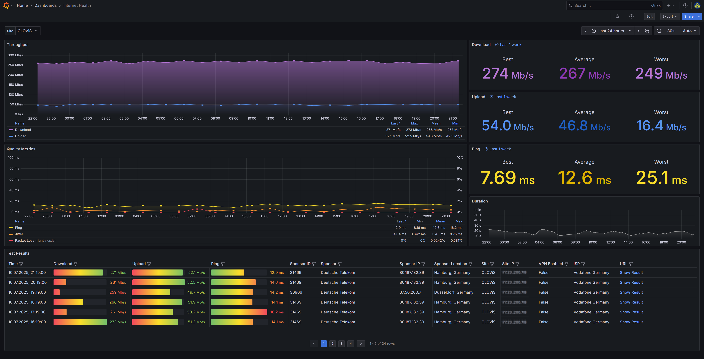

# Prometheus Speedtest Exporter

<p align="center">
  
</p>

A self-contained Python 3 exporter that runs the \[Ookla® Speedtest CLI] on every Prometheus or Grafana Alloy scrape and exposes the results (`download`, `upload`, `ping`, `jitter`, …) in a **/metrics** endpoint that Grafana can visualise via the included dashboard.

---

## Features

* **Metrics ready-made for Prometheus**
  `speedtest_download`, `speedtest_upload`, `speedtest_ping`, `speedtest_jitter`, `speedtest_packetloss`, plus test, server and client metadata gauges.
* **Stateless exporter** – every scrape triggers a fresh speed test, no local database required.
* **Configurable server selection** – list preferred server IDs or let the CLI auto-select the closest one.
* **Systemd service file provided** for background operation on Linux.
* **Grafana dashboard JSON** included for one-click import.

---

## Requirements

| Requirement                   | Notes                                    |
| ----------------------------- | ---------------------------------------- |
| Python ≥ 3.8                  | Tested on Ubuntu 22.04 / Debian 12       |
| Ookla Speedtest CLI           | Install from the official apt repository |
| Prometheus (or Grafana Alloy) | Any recent version                       |
| Grafana                       | To visualize the collected data          |

---

## Quick-start (Ubuntu / Debian)

```bash
# 1 – install Speedtest CLI
curl -s https://packagecloud.io/install/repositories/ookla/speedtest-cli/script.deb.sh | sudo bash
sudo apt-get install speedtest              # installs /usr/bin/speedtest

# 2 – clone this repository
git clone https://github.com/barrax63/Prometheus-Speedtest-Exporter.git
cd Prometheus-Speedtest-Exporter

# 3 – create a dedicated virtualenv
python3 -m venv venv
source venv/bin/activate
pip install prometheus_client
deactivate

# 4 – test it
./venv/bin/python speedtest_v2.py           # listens on 0.0.0.0:9110/metrics by default
```

Browse to **[http://localhost:9110/metrics](http://localhost:9110/metrics)** and you should see real-time numbers.

---

## Running as a service

Copy `speedtest.service` to `/etc/systemd/system/`, adjust the **User**, **Group** and paths if needed, then:

```bash
sudo systemctl daemon-reload
sudo systemctl enable speedtest
sudo systemctl start speedtest
```

The service runs the exporter continuously and restarts automatically on failure.

---

## Option A: Grafana Alloy configuration

Add a job for the speedtest to the Grafana Alloy config file, usually located under `/etc/alloy/config.alloy`.

```hcl
prometheus.scrape "speedtest" {
  targets         = [{ "__address__" = "127.0.0.1:9110" }]
  scrape_interval = "60m"
  scrape_timeout  = "60s"
}
```

## Option B: Prometheus configuration

Add a job for the speedtest to the Prometheus config file, usually located under `/etc/prometheus/prometheus.yml`

```hcl
- job_name: 'speedtest'
  static_configs:
    - targets: ['localhost:9110']
  scrape_interval: 60m
  scrape_timeout: 60s
```

Feel free to shorten the interval, but be aware that each scrape launches a full Speedtest and may count against Ookla’s fair-use limits or your ISP’s bandwidth caps.
The default is **one speedtest per hour**.

---

## Importing the Grafana dashboard

1. Open **Grafana → Dashboards → Import**.
2. Upload the dashboard config `speedtest-dashboard.json`.
3. Select your Prometheus data-source.

If the script is already running for at least an hour, the dashboard shows trend panels for download / upload, latency, jitter and packet loss, plus test-by-test details.

---

## Configuration

| Setting      | Where                    | Description                                                                                                      |
| ------------ | ------------------------ | ---------------------------------------------------------------------------------------------------------------- |
| `SERVER_IDS` | top of `speedtest_v2.py` | Ordered list of preferred server IDs; first one that responds is used. Comment out to let Speedtest auto-select. |
| `PORT`       | top of `speedtest_v2.py` | Defaults to **9110**; change it if needed.                                                                       |
| `OOKLA_OPTS` | `speedtest_v2.py`        | Passed verbatim to the `speedtest` binary; defaults accept license & GDPR and output JSON in bits per second.    |

---

## Metrics reference

| Metric                     | Label set                               | Unit            |
| -------------------------- | --------------------------------------- | --------------- |
| `speedtest_download`       | `timestamp`                             | bit/s           |
| `speedtest_upload`         | `timestamp`                             | bit/s           |
| `speedtest_ping`           | `timestamp`                             | ms              |
| `speedtest_jitter`         | `timestamp`                             | ms              |
| `speedtest_packetloss`     | `timestamp`                             | %               |
| `speedtest_bytes_sent`     | `timestamp`                             | bytes           |
| `speedtest_bytes_received` | `timestamp`                             | bytes           |
| `speedtest_elapsed_time`   | `timestamp`                             | s               |
| `speedtest_server_info`    | `timestamp,id,name,location,country,ip` | 1 (info metric) |
| `speedtest_client_info`    | `timestamp,ip,vpn,isp`                  | 1               |
| `speedtest_result_info`    | `timestamp,url`                         | 1               |

---

## License

Distributed under the MIT License. See `LICENSE` for details.